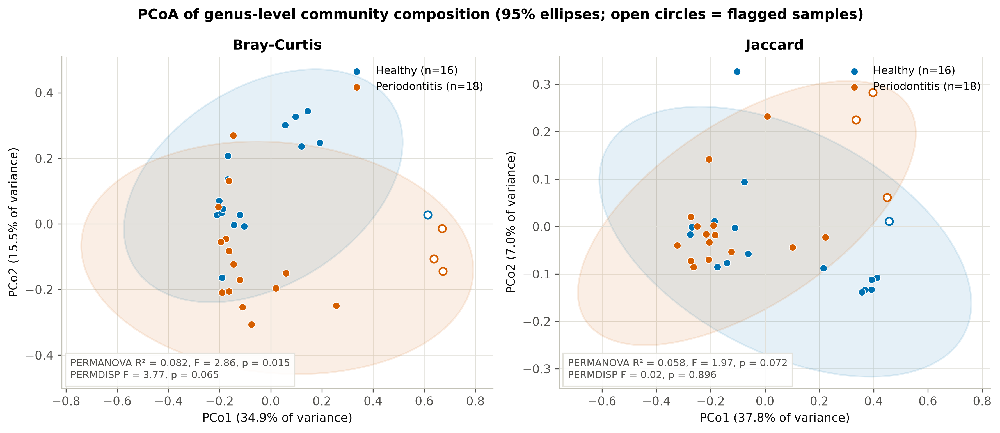
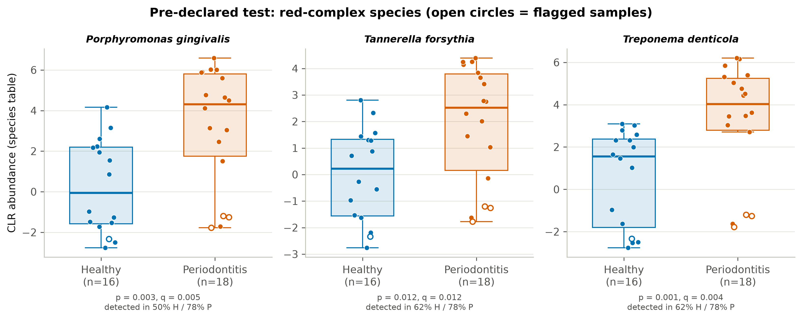
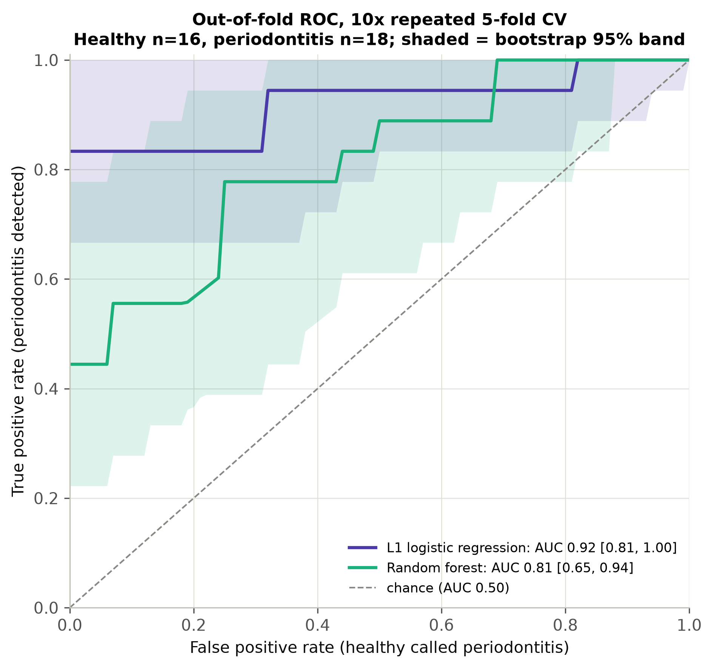
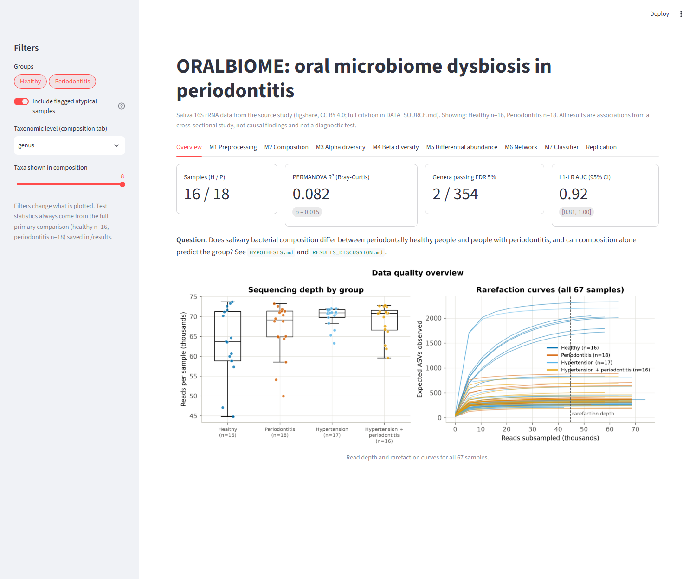
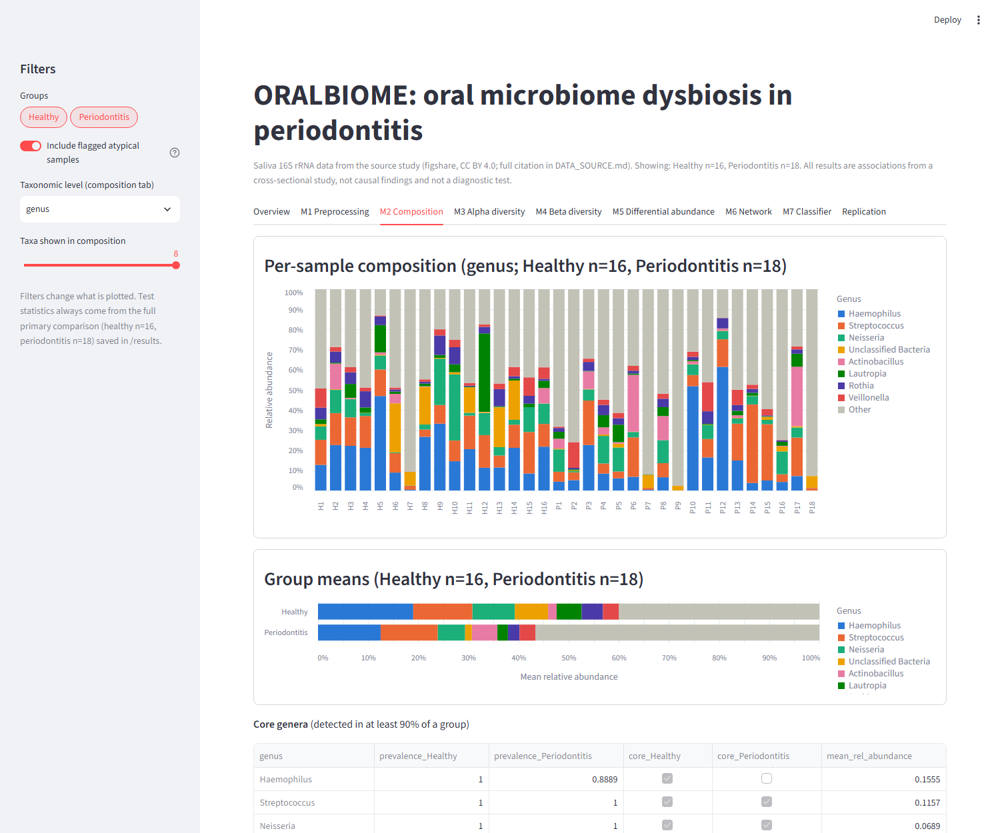
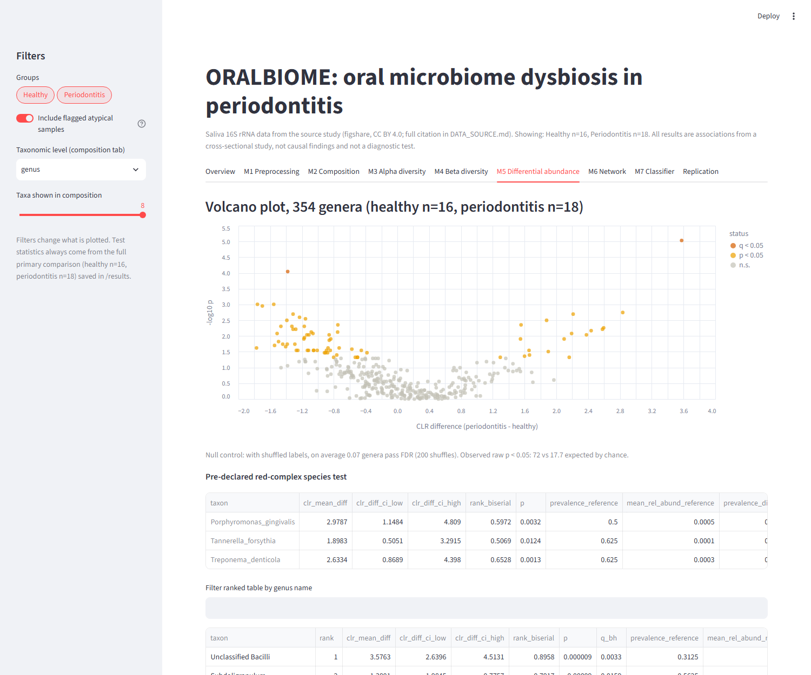

# ORALBIOME - Oral Microbiome Dysbiosis Analysis Pipeline

A reproducible Python pipeline that asks whether the salivary bacterial
community differs between periodontally healthy people and people with
periodontitis, and whether community composition alone can predict the group.
It runs on a real public 16S rRNA dataset, tests pre-registered predictions
(`HYPOTHESIS.md`), includes negative and positive controls, and checks whether
the findings replicate in a second group of participants.

**Short version of the answer:** in the primary comparison (16 healthy vs 18
periodontitis saliva samples), overall composition differs modestly
(PERMANOVA R² = 0.082, p = 0.015), all three "red-complex" periodontal
pathogens are more abundant in periodontitis (q ≤ 0.012), and an L1 logistic
regression separates the groups well above a permuted-label null (AUC 0.92,
95% CI 0.81-1.00). But the classifier leans heavily on one unidentified
taxon, some healthy-group differences look like contamination, and **none of
the community-level signals replicate in the hypertensive participants (T vs
TP)**. These are associations in a small, cross-sectional dataset, not
causal or clinical findings.



## Contents

- [Data](#data)
- [How to run](#how-to-run)
- [Results](#results)
- [Methods by module](#methods-by-module)
- [Dashboard](#dashboard)
- [Limitations](#limitations)
- [Repository layout](#repository-layout)

## Data

Guo et al., "A comparative analysis of oral microbial communities in
hypertensive patients with and without chronic periodontitis", *BMC Oral
Health* 26:836 (2026). Processed ASV table deposited on figshare
([10.6084/m9.figshare.29897750](https://doi.org/10.6084/m9.figshare.29897750.v1),
CC BY 4.0). Unstimulated saliva, 16S rRNA V3-V4, Illumina NovaSeq,
periodontitis diagnosed with the 2018 AAP/EFP classification. Details, the
exact URL and the access date are in [DATA_SOURCE.md](DATA_SOURCE.md).

| Group | Meaning | n | Use |
|---|---|---|---|
| H | Periodontally healthy, normotensive | 16 | primary comparison |
| P | Periodontitis, normotensive | 18 | primary comparison |
| T | Hypertension, periodontally healthy | 17 | replication |
| TP | Hypertension + periodontitis | 16 | replication |

The table has 25,540 features, 67 samples and 4,503,386 reads (44,786-73,730
per sample). **Real data was used for every result below.** The pipeline can
fall back to a clearly labelled SYNTHETIC Dirichlet-multinomial dataset if the
download fails; that generator is also used as a positive control.

## How to run

Requires Python 3.11+ (developed on 3.14, Windows 11, CPU only).

```bash
python -m venv .venv
# Windows: .venv\Scripts\activate      macOS/Linux: source .venv/bin/activate
pip install -r requirements.txt
pip install -e .

python run_all.py          # regenerates every table in results/ and figure in figures/ (~3 min)
python -m pytest           # 36 tests, ~10 s
streamlit run app.py       # interactive dashboard
```

The raw zip is cached in `data/raw/`, so everything runs offline.
`python run_all.py --synthetic` runs the whole pipeline on the synthetic
fallback instead. All randomness is seeded (seed 42); a rerun in a fresh
clone with a fresh virtual environment reproduced every output byte for byte.

## Results

All numbers come from `results/` (mainly `results/summary.json`). Tests are
two-sided; "q" is a Benjamini-Hochberg FDR-adjusted p-value; *r* is the
rank-biserial effect size (positive = higher in periodontitis).

### Predictions vs findings (primary comparison, H n=16 vs P n=18)

| # | Prediction | Result | Verdict |
|---|---|---|---|
| P1 | Alpha diversity differs | Shannon p = 0.796, r = +0.06 [95% CI -0.35, +0.45]; no metric passes BH across the 4 metrics (lowest: Pielou's evenness p = 0.037, q = 0.147) | **Not supported** |
| P2 | Groups separate in beta-diversity space | Bray-Curtis PERMANOVA R² = 0.082, F = 2.86, p = 0.015; PERMDISP p = 0.065; Jaccard p = 0.072 | **Supported, with a caveat** (dispersion borderline) |
| P3 | Red-complex species enriched in periodontitis | *P. gingivalis* q = 0.005, *T. forsythia* q = 0.012, *T. denticola* q = 0.004 (all higher in P) | **Supported** (pre-declared test) |
| P4 | Composition predicts disease above chance | L1-LR AUC 0.92 [0.81, 1.00], RF 0.81 [0.65, 0.94]; permutation p = 0.0099 for both | **Supported, with a caveat** (depends heavily on one taxon) |
| P5 | Red-complex genera co-occur | Spearman rho 0.68-0.85 for all three pairs, q < 0.001 | **Supported** |
| - | Replication in T (n=17) vs TP (n=16) | PERMANOVA p = 0.402; L1-LR AUC 0.52 [0.32, 0.72], permutation p = 0.495; red-complex species q = 0.53-0.76 | **Did not replicate** |

The full evaluation, including what each result does and does not mean, is in
[RESULTS_DISCUSSION.md](RESULTS_DISCUSSION.md).

### Alpha diversity (genus level, rarefied to 44,786 reads)

| Metric | Median H | Median P | p | q (4 metrics) | r [95% CI] |
|---|---|---|---|---|---|
| Shannon | 2.884 | 3.086 | 0.796 | 0.796 | +0.06 [-0.35, +0.45] |
| Gini-Simpson | 0.899 | 0.915 | 0.234 | 0.312 | +0.24 [-0.16, +0.62] |
| Observed genera | 179.5 | 140.0 | 0.133 | 0.267 | -0.31 [-0.67, +0.11] |
| Pielou's evenness | 0.561 | 0.640 | 0.037 | 0.147 | +0.42 [+0.03, +0.78] |

Sensitivity analyses (feature level; excluding flagged samples) gave the same
picture: no Shannon difference (p = 0.904 and 0.934).

### Beta diversity (354 prevalence-filtered genera, 999 permutations)

| Distance | PERMANOVA R² | p | PERMDISP p | PERMANOVA p without 4 flagged samples |
|---|---|---|---|---|
| Bray-Curtis | 0.082 | 0.015 | 0.065 | 0.002 (R² = 0.119) |
| Jaccard | 0.058 | 0.072 | 0.896 | 0.007 (R² = 0.097) |

### Differential abundance (354 genera)

- 2 genera pass FDR 5%: "Unclassified Bacilli" (higher in P, q = 0.003,
  r = +0.90) and *Subdoligranulum* (higher in H, q = 0.016, r = -0.79).
- 72 genera have raw p < 0.05, versus 17.7 expected by chance; with shuffled
  labels, an average of 0.07 genera pass FDR (200 shuffles).
- Known periodontitis-associated genera sit just below the FDR line and all
  lean towards periodontitis: *Fretibacterium* (rank 6, q = 0.089),
  *Peptococcus* (rank 7, q = 0.089), *Treponema* (rank 11, q = 0.094),
  *Tannerella* (rank 34, q = 0.122); *Porphyromonas* as a whole genus does
  not differ (rank 108, q = 0.323), even though the species *P. gingivalis*
  does.
- The top healthy-leaning genera (*Subdoligranulum*, *Enterobacter*,
  *Nordella*, *Psychrobacter*) are detected in all 6 of the 6 unusually
  high-richness healthy samples but rarely elsewhere
  (`results/m5_high_richness_check.csv`), so they may reflect contamination
  or batch rather than biology.



### Classifier (10x repeated 5-fold CV, preprocessing inside folds)

| Model | AUC [bootstrap 95% CI] | Mean AUC over repeats | Null AUC mean | Permutation p | AUC without flagged samples | AUC without "Unclassified Bacilli" |
|---|---|---|---|---|---|---|
| L1 logistic regression | 0.92 [0.81, 1.00] | 0.917 | 0.493 | 0.0099 | 0.932 | 0.636 |
| Random forest | 0.81 [0.65, 0.94] | 0.790 | 0.498 | 0.0099 | 0.870 | 0.723 |



### Co-occurrence network

217 genera (present in ≥30% of samples) → 177 genera and 1,426 edges with
|rho| ≥ 0.6 and q < 0.05 (1,021 positive, 405 negative). Top hubs by degree:
*Campylobacter* (66), *Fusobacterium* (58), *Tannerella* (58), *Prevotella*
(53), *Catonella* (51), *Porphyromonas* (49), *Treponema* (49). 9 of the top 10
hubs lean towards periodontitis in M5, consistent with a co-varying
anaerobic consortium.

### Positive control (synthetic data with planted differences)

Of 15 planted genera, 10 were recovered at FDR 5% in the correct direction
(sensitivity 67%), with 1 false positive (false discovery proportion 9%),
PERMANOVA p = 0.002 (`results/synthetic_validation.json`).

## Methods by module

Full formulas are in [METHODS.md](METHODS.md); every threshold and judgement
call is justified in [DECISIONS.md](DECISIONS.md).

| Module | What it does |
|---|---|
| Data layer | Downloads and caches the figshare zip, parses the BIOM table, cleans SILVA taxonomy, writes a QC report (read depth, sparsity, rarefaction curves), flags samples where >50% of reads come from features seen in no other sample (H7, P7, P9, P18; T9, T10, TP7, TP15) |
| M1 Preprocessing | Aggregates to genus; prevalence filter (≥10% of samples and mean relative abundance ≥0.01%); rarefied counts (for alpha diversity), relative abundances and CLR with pseudocount 0.5 (for everything else) |
| M2 Composition | Stacked bars per sample and per group at phylum and genus level; core microbiome (≥90% prevalence within a group) |
| M3 Alpha diversity | Shannon, Gini-Simpson, observed richness, Pielou's evenness; Mann-Whitney U, rank-biserial r with bootstrap CI, BH across metrics; two sensitivity analyses |
| M4 Beta diversity | Bray-Curtis and Jaccard; PCoA and NMDS with 95% ellipses; PERMANOVA and PERMDISP implemented from scratch with 999 permutations |
| M5 Differential abundance | Per-genus Mann-Whitney U on CLR, BH-FDR, volcano plot, ranked table, label-shuffled null; pre-declared species-level red-complex test |
| M6 Network | Spearman correlation on CLR abundances, \|rho\| ≥ 0.6 and q < 0.05, hubs by degree |
| M7 Classifier | L1 logistic regression (inner CV tunes C, i.e. nested CV) and random forest; repeated stratified CV; bootstrap CIs; 100-shuffle permuted-label null; ablation |
| Replication | Same pipeline on T vs TP, compared in a forest plot |

## Dashboard

`streamlit run app.py` opens a dashboard with one tab per module, filters for
group, flagged samples, taxonomic level (phylum to genus) and number of taxa.



| Composition | Differential abundance |
|---|---|
|  |  |

## Limitations

- **16S resolution.** A ~470 bp V3-V4 amplicon usually identifies bacteria
  reliably only to genus; species labels such as *P. gingivalis* depend on the
  reference database and can be wrong for close relatives. 16S says nothing
  about genes or function (e.g. gingipain or other virulence genes) and does
  not distinguish live from dead cells.
- **Compositional data.** Sequencing gives proportions, not absolute amounts,
  so an apparent increase in one taxon can be a decrease in others. CLR
  transforms reduce but do not remove this problem, and the result depends
  slightly on the pseudocount used for zeros.
- **Batch effects and contamination.** Several samples contain many
  soil- or gut-associated features found in no other sample, and six healthy
  samples have roughly five times the usual number of features. Sample
  processing order, extraction batch and negative controls are not available,
  so contamination and batch cannot be separated from biology. Flag-based
  sensitivity analyses are reported, but they cannot fix this.
- **Small sample size.** 16 vs 18 people gives wide confidence intervals (for
  example, the AUC CI spans 0.81 to 1.00) and low power for 354 genus-level
  tests. Only one taxon drives most of the classifier's performance.
- **Cross-sectional design.** Samples were taken at one time point, so it is
  impossible to tell whether community differences precede periodontitis,
  result from it (for example, deeper pockets favour anaerobes), or are both
  caused by something else (smoking, oral hygiene, age, diet, medication).
  No covariates were available to adjust for.
- **Saliva, one study.** Saliva mixes bacteria from all oral surfaces and
  dilutes the subgingival pocket community where periodontitis occurs. All
  groups come from one study and one sequencing run, so the replication is
  internal only.
- **No clinical or diagnostic value.** Nothing here should be used to
  diagnose, predict or treat periodontitis.

## Repository layout

```
run_all.py            full pipeline (writes results/ and figures/)
app.py                Streamlit dashboard
src/oralbiome/        one module per step (data, qc, preprocessing, composition, alpha,
                      beta, differential, network, classifier, replication, validation)
tests/                pytest suite (36 tests)
data/raw/             cached original zip (CC BY 4.0)
data/processed/       parsed and derived tables
results/              every number reported anywhere
figures/              16 figures at 300 dpi + CAPTIONS.md
docs/screenshots/     dashboard screenshots
HYPOTHESIS.md  METHODS.md  DECISIONS.md  RESULTS_DISCUSSION.md  DATA_SOURCE.md
```

Data: Guo Z. et al. (2025), figshare, CC BY 4.0.
